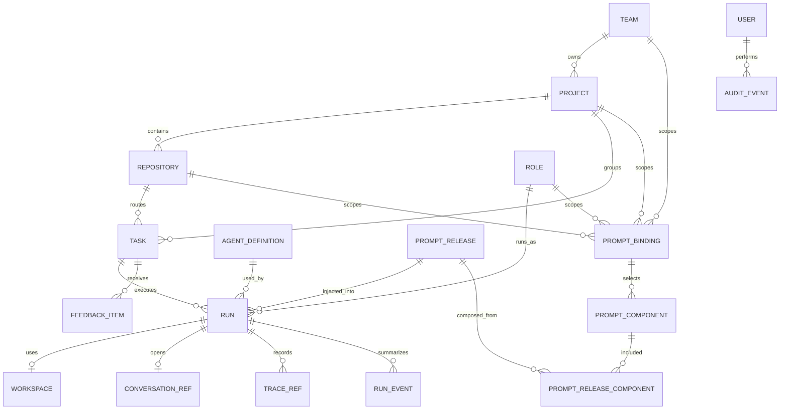

# Agent Control Plane ERD

## 设计目标

本文定义 Agent Control Plane 的核心数据模型。Plane、OpenHands、Langfuse 都是外部系统，本系统只持久化必要引用和控制面状态，不复制大体量事件日志。

原则：

- Plane 是任务事实源。
- Control Plane 是 agent runtime 调度事实源。
- OpenHands 是 conversation/event log 事实源。
- Langfuse 是 prompt/LLM trace 事实源。
- 本系统保存跨系统关联 id，保证一次 run 可从任务追到代码执行和 LLM trace。
- Plane 按 self-host 和可二开前提设计；Control Plane 不直接读写 Plane 数据库，优先 API/webhook 集成。
- Trace 默认完整记录，便于个人调试；Control Plane 仍保存必要快照和引用。

## 核心关系图



## 表定义

### teams

业务团队。

| 字段              | 类型        | 说明              |
| ----------------- | ----------- | ----------------- |
| id                | uuid        | 主键              |
| external_provider | text        | `plane` 等        |
| external_team_id  | text        | 外部 team id      |
| key               | text        | 例如 `TOK`        |
| name              | text        | 例如 `token-team` |
| description       | text        | 团队说明          |
| created_at        | timestamptz | 创建时间          |
| updated_at        | timestamptz | 更新时间          |

唯一约束：

- `(external_provider, external_team_id)`
- `key`

### projects

产品/业务项目。token-team 下 crs/sub2/traffic 合并后，应只有一个 `token` project，通过 repo 路由。

| 字段                | 类型        | 说明              |
| ------------------- | ----------- | ----------------- |
| id                  | uuid        | 主键              |
| team_id             | uuid        | 关联 teams        |
| external_project_id | text        | Plane project id  |
| slug                | text        | 例如 `token`      |
| name                | text        | 项目名            |
| description         | text        | 项目背景          |
| status              | text        | active / archived |
| created_at          | timestamptz | 创建时间          |
| updated_at          | timestamptz | 更新时间          |

唯一约束：

- `(team_id, slug)`
- `(team_id, external_project_id)`

### repositories

项目下的代码仓库。

| 字段           | 类型        | 说明                           |
| -------------- | ----------- | ------------------------------ |
| id             | uuid        | 主键                           |
| project_id     | uuid        | 关联 projects                  |
| slug           | text        | `crs-src` / `sub3` / `traffic` |
| git_url        | text        | git ssh/http 地址              |
| default_branch | text        | 默认分支                       |
| local_path     | text        | 本地 checkout 路径             |
| status         | text        | active / archived              |
| description    | text        | 仓库背景                       |
| created_at     | timestamptz | 创建时间                       |
| updated_at     | timestamptz | 更新时间                       |

唯一约束：

- `(project_id, slug)`
- `git_url`

### tasks

从 Plane 同步来的任务镜像。正文和评论不做长期事实源，只缓存必要摘要和同步游标。

| 字段                | 类型        | 说明                                      |
| ------------------- | ----------- | ----------------------------------------- |
| id                  | uuid        | 主键                                      |
| project_id          | uuid        | 关联 projects                             |
| repository_id       | uuid        | 关联 repositories，可为空                 |
| external_task_id    | text        | Plane work item id                        |
| identifier          | text        | 人类可读编号                              |
| title               | text        | 标题                                      |
| state               | text        | 当前状态；`Blocked` 表示 stalled/人工处理 |
| priority            | int         | 优先级                                    |
| labels              | jsonb       | 标签缓存                                  |
| assignee            | text        | 负责人缓存                                |
| url                 | text        | Plane URL                                 |
| retry_after_attempt | int         | 人工重新放行 retry 的 attempt baseline    |
| last_synced_at      | timestamptz | 最近同步时间                              |
| sync_cursor         | text        | 评论/事件同步游标                         |
| created_at          | timestamptz | 创建时间                                  |
| updated_at          | timestamptz | 更新时间                                  |

唯一约束：

- `(project_id, external_task_id)`
- `(project_id, identifier)`

关键约束：

- `repository_id` 允许为空，保证 Plane 新任务可以先同步入库。
- 派发查询必须要求 `repository_id is not null`。没有 repo 的任务不能派发 agent。
- `Blocked` 不进入自动派发队列；operator 检查后可转回 `Development`、`Done` 或 `Canceled`。

### roles

Agent 角色。

| 字段          | 类型        | 说明                                       |
| ------------- | ----------- | ------------------------------------------ |
| id            | uuid        | 主键                                       |
| key           | text        | intake / development / code_review / merge |
| name          | text        | 展示名                                     |
| active_states | text[]      | 可接单状态                                 |
| next_states   | text[]      | 允许推进的状态                             |
| description   | text        | 职责说明                                   |
| created_at    | timestamptz | 创建时间                                   |
| updated_at    | timestamptz | 更新时间                                   |

唯一约束：

- `key`

### agent_definitions

平台里可配置的 agent。

| 字段             | 类型        | 说明                |
| ---------------- | ----------- | ------------------- |
| id               | uuid        | 主键                |
| name             | text        | agent 名称          |
| role_id          | uuid        | 默认角色            |
| runtime          | text        | `openhands`         |
| model            | text        | 模型名              |
| reasoning_effort | text        | low / medium / high |
| tool_profile     | text        | 工具权限配置        |
| max_turns        | int         | 最大轮数            |
| timeout_seconds  | int         | 超时                |
| status           | text        | active / disabled   |
| created_at       | timestamptz | 创建时间            |
| updated_at       | timestamptz | 更新时间            |

### prompt_components

Prompt 片段。

| 字段       | 类型        | 说明                                  |
| ---------- | ----------- | ------------------------------------- |
| id         | uuid        | 主键                                  |
| scope_type | text        | global / team / project / repo / role |
| scope_id   | uuid        | 对应 scope id，global 可为空          |
| name       | text        | prompt 名称                           |
| version    | int         | 版本号                                |
| status     | text        | draft / active / archived             |
| content    | text        | Markdown prompt                       |
| changelog  | text        | 修改说明                              |
| author     | text        | 作者                                  |
| created_at | timestamptz | 创建时间                              |
| updated_at | timestamptz | 更新时间                              |

唯一约束：

- `(scope_type, scope_id, name, version)`

### prompt_bindings

声明某个 scope 当前使用哪个 prompt component。

| 字段                | 类型        | 说明                                 |
| ------------------- | ----------- | ------------------------------------ |
| id                  | uuid        | 主键                                 |
| scope_type          | text        | team / project / repo / role / agent |
| scope_id            | uuid        | 对应 scope id                        |
| prompt_component_id | uuid        | 绑定的 prompt component              |
| order_index         | int         | 装配顺序                             |
| environment         | text        | dev / staging / prod                 |
| status              | text        | active / disabled                    |
| created_at          | timestamptz | 创建时间                             |
| updated_at          | timestamptz | 更新时间                             |

### prompt_releases

一次实际装配后的 prompt 快照。Run 必须引用它。

| 字段                    | 类型        | 说明                             |
| ----------------------- | ----------- | -------------------------------- |
| id                      | uuid        | 主键                             |
| task_id                 | uuid        | 关联 tasks                       |
| repository_id           | uuid        | 关联 repositories                |
| role_id                 | uuid        | 关联 roles                       |
| agent_definition_id     | uuid        | 关联 agent_definitions           |
| langfuse_prompt_id      | text        | Langfuse prompt id               |
| langfuse_prompt_version | text        | Langfuse prompt version/label    |
| content_hash            | text        | 最终 prompt hash                 |
| rendered_content        | text        | 最终装配结果，默认落库，便于追溯 |
| created_at              | timestamptz | 创建时间                         |

### prompt_release_components

记录 prompt release 由哪些组件组成。

| 字段                | 类型 | 说明                   |
| ------------------- | ---- | ---------------------- |
| id                  | uuid | 主键                   |
| prompt_release_id   | uuid | 关联 prompt_releases   |
| prompt_component_id | uuid | 关联 prompt_components |
| order_index         | int  | 装配顺序               |
| content_hash        | text | 组件内容 hash          |

唯一约束：

- `(prompt_release_id, order_index)`

### runs

一次 agent 执行。

| 字段                | 类型        | 说明                                                                 |
| ------------------- | ----------- | -------------------------------------------------------------------- |
| id                  | uuid        | 主键                                                                 |
| task_id             | uuid        | 关联 tasks                                                           |
| repository_id       | uuid        | 关联 repositories                                                    |
| role_id             | uuid        | 关联 roles                                                           |
| agent_definition_id | uuid        | 关联 agent_definitions                                               |
| prompt_release_id   | uuid        | 关联 prompt_releases                                                 |
| status              | text        | queued / claimed / running / succeeded / blocked / failed / canceled |
| lease_owner         | text        | 当前执行者                                                           |
| lease_expires_at    | timestamptz | lease 到期时间                                                       |
| heartbeat_at        | timestamptz | 最近 heartbeat                                                       |
| attempt             | int         | 第几次尝试                                                           |
| started_at          | timestamptz | 开始时间                                                             |
| finished_at         | timestamptz | 结束时间                                                             |
| result_summary      | text        | 结果摘要                                                             |
| failure_reason      | text        | 失败原因                                                             |
| next_state          | text        | 建议推进状态                                                         |
| token_input         | bigint      | 输入 token                                                           |
| token_output        | bigint      | 输出 token                                                           |
| token_total         | bigint      | 总 token                                                             |
| cost_usd            | numeric     | 成本                                                                 |
| created_at          | timestamptz | 创建时间                                                             |
| updated_at          | timestamptz | 更新时间                                                             |

索引：

- `(task_id, created_at desc)`
- `(status, lease_expires_at)`
- `(repository_id, status)`

### workspaces

一次 run 使用的代码工作区。

| 字段          | 类型        | 说明                                           |
| ------------- | ----------- | ---------------------------------------------- |
| id            | uuid        | 主键                                           |
| run_id        | uuid        | 关联 runs                                      |
| repository_id | uuid        | 关联 repositories                              |
| strategy      | text        | clone / worktree / existing                    |
| path          | text        | 本地 workspace 路径                            |
| base_ref      | text        | 基准分支或 commit                              |
| head_ref      | text        | 工作分支或 commit                              |
| status        | text        | preparing / ready / dirty / archived / cleaned |
| created_at    | timestamptz | 创建时间                                       |
| cleaned_at    | timestamptz | 清理时间                                       |

唯一约束：

- `run_id`

第一版每个 run 都会登记一个独立 workspace 记录，默认 strategy 为 `clone`。路径优先使用
repository `local_path`，否则使用 `workspaces/<repo>/runs/<run_id>`。Control Plane 只保存
workspace 事实和路径，并把路径传给 OpenHands conversation；实际 checkout / sandbox 准备由
OpenHands runtime 负责。稳定后再引入 `git worktree` 优化磁盘和 clone 成本。

### conversation_refs

OpenHands conversation 引用。

| 字段            | 类型        | 说明                      |
| --------------- | ----------- | ------------------------- |
| id              | uuid        | 主键                      |
| run_id          | uuid        | 关联 runs                 |
| provider        | text        | `openhands`               |
| conversation_id | text        | OpenHands conversation id |
| event_log_uri   | text        | event log 地址或本地路径  |
| event_cursor    | text        | 已消费 event cursor       |
| ui_url          | text        | OpenHands UI 地址         |
| created_at      | timestamptz | 创建时间                  |
| updated_at      | timestamptz | 更新时间                  |

唯一约束：

- `(provider, conversation_id)`
- `run_id`

### trace_refs

Langfuse trace 引用。一次 run 可包含多个 trace/generation。

| 字段              | 类型        | 说明                   |
| ----------------- | ----------- | ---------------------- |
| id                | uuid        | 主键                   |
| run_id            | uuid        | 关联 runs              |
| provider          | text        | `langfuse`             |
| trace_id          | text        | Langfuse trace id      |
| generation_id     | text        | Langfuse generation id |
| model             | text        | 模型名                 |
| prompt_release_id | uuid        | 使用的 prompt release  |
| input_tokens      | bigint      | 输入 token             |
| output_tokens     | bigint      | 输出 token             |
| cost_usd          | numeric     | 成本                   |
| latency_ms        | int         | 延迟                   |
| ui_url            | text        | Langfuse URL           |
| created_at        | timestamptz | 创建时间               |

索引：

- `(run_id)`
- `(trace_id)`
- `(prompt_release_id)`

### run_events

Control Plane 自己的轻量事件，不替代 OpenHands event log。当前事件还承担 run detail
timeline、feedback 打回记录和 observability refs 记录。

| 字段       | 类型        | 说明                                                                                |
| ---------- | ----------- | ----------------------------------------------------------------------------------- |
| id         | uuid        | 主键                                                                                |
| run_id     | uuid        | 关联 runs                                                                           |
| event_type | text        | queued / claimed / heartbeat / state_sync / blocked / completed / failed / canceled |
| message    | text        | 简短摘要                                                                            |
| payload    | jsonb       | 结构化数据                                                                          |
| created_at | timestamptz | 创建时间                                                                            |

索引：

- `(run_id, created_at)`
- `(event_type, created_at)`

### feedback_items

来自 reviewer、人类、PR comment 或 agent 自检的返工反馈。Development agent 下一次启动前必须读取 unresolved feedback。
当前写入入口包括 Run Detail UI 和 `POST /api/runs/{run_id}/feedback`。

| 字段         | 类型        | 说明                                                    |
| ------------ | ----------- | ------------------------------------------------------- |
| id           | uuid        | 主键                                                    |
| task_id      | uuid        | 关联 tasks                                              |
| run_id       | uuid        | 关联发现问题的 runs，可为空                             |
| source       | text        | human / code_review / pr_review / agent / plane_comment |
| severity     | text        | info / minor / major / blocker                          |
| body         | text        | 反馈内容                                                |
| external_url | text        | Plane comment、PR comment 或 check URL                  |
| resolved_at  | timestamptz | 解决时间                                                |
| created_at   | timestamptz | 创建时间                                                |

索引：

- `(task_id, resolved_at)`
- `(source, created_at)`

### users

第一版按个人/小团队内部系统设计，但仍保留最小用户模型用于审计。

| 字段              | 类型        | 说明                   |
| ----------------- | ----------- | ---------------------- |
| id                | uuid        | 主键                   |
| external_provider | text        | github / plane / local |
| external_user_id  | text        | 外部用户 id            |
| name              | text        | 展示名                 |
| email             | text        | 邮箱                   |
| created_at        | timestamptz | 创建时间               |
| updated_at        | timestamptz | 更新时间               |

### audit_events

记录 prompt 发布、状态强改、destructive action 等关键动作。

| 字段          | 类型        | 说明             |
| ------------- | ----------- | ---------------- |
| id            | uuid        | 主键             |
| actor_user_id | uuid        | 操作用户，可为空 |
| action        | text        | 操作名           |
| entity_type   | text        | 实体类型         |
| entity_id     | uuid        | 实体 id          |
| message       | text        | 摘要             |
| payload       | jsonb       | 结构化详情       |
| created_at    | timestamptz | 创建时间         |

索引：

- `(entity_type, entity_id, created_at)`
- `(action, created_at)`

## 关键查询

### 查询可派发任务

```sql
select t.*
from tasks t
join repositories r on r.id = t.repository_id
left join feedback_items f on f.task_id = t.id and f.resolved_at is null
where t.state in ('Todo', 'Development', 'Code Review', 'In Merge', 'Release Version', 'Deployment')
  and t.repository_id is not null
  and r.status = 'active'
  and not exists (
    select 1
    from runs rr
    where rr.task_id = t.id
      and rr.status in ('queued', 'claimed', 'running')
      and rr.lease_expires_at > now()
  )
order by t.priority asc nulls last, t.updated_at asc;
```

实现中会把 unresolved feedback 附加进 worker task comments，供下一轮 Development
prompt 使用。

### 查询 run 详情

```sql
select
  r.*,
  c.conversation_id,
  c.ui_url as openhands_url,
  tr.trace_id,
  tr.ui_url as langfuse_url,
  tr.input_tokens,
  tr.output_tokens,
  tr.cost_usd,
  pr.rendered_content
from runs r
left join conversation_refs c on c.run_id = r.id
left join trace_refs tr on tr.run_id = r.id
left join prompt_releases pr on pr.id = r.prompt_release_id
where r.id = $1;
```

### 查询 prompt 版本效果

```sql
select
  pr.langfuse_prompt_id,
  pr.langfuse_prompt_version,
  count(*) as run_count,
  avg(r.token_total) as avg_tokens,
  avg(r.cost_usd) as avg_cost_usd,
  sum(case when r.status = 'completed' then 1 else 0 end)::float / count(*) as success_rate
from prompt_releases pr
join runs r on r.prompt_release_id = pr.id
group by pr.langfuse_prompt_id, pr.langfuse_prompt_version;
```

## 数据边界

不在 Control Plane 中长期保存：

- Plane 完整评论历史。
- OpenHands 完整 event log。
- repo 源码内容。

需要保存引用：

- Plane task id/url。
- OpenHands conversation id/event log URI。
- Langfuse trace id/generation id。
- prompt release id/hash。

默认保存：

- 最终装配后的 `rendered_content`。
- token/cost/latency 摘要。
- run result summary。
- unresolved feedback。

## 安全要求

- `rendered_content` 默认落库，方便追溯；后续如接入敏感项目，可改为只存 hash/reference。
- Langfuse 默认保存完整 trace，方便调试。
- 不做复杂脱敏管线，只做最小 secret 防护：避免主动采集 `.env`、API key、SSH key。
- repository local path 不应暴露给普通用户。
- 任何 destructive action 必须记录 run_event。
- prompt publish、prompt rollback、状态强改必须记录 audit_event。
- prompt release 一旦被 run 引用，不允许修改，只能创建新版本。
