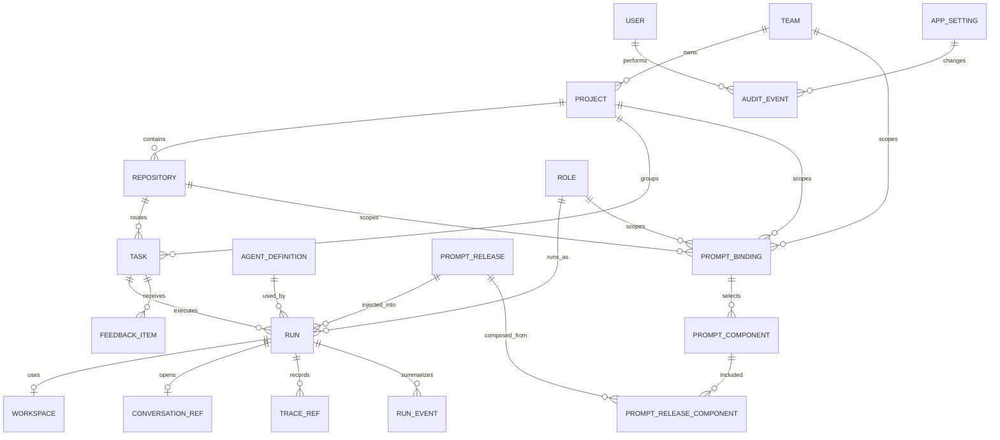

# Agent Control Plane ERD

## 设计目标

本文定义 Agent Control Plane 的核心数据模型。Plane、OpenHands、Langfuse 都是外部系统，本系统只持久化必要引用和控制面状态，不复制大体量事件日志。

Plane Agent / Prompt / Project Workspace 的产品化管理已经迁移到 Plane 作为可编辑事实源。相关 Plane extension tables、ACP projection tables、Run Pipeline、Project Meta Git 和 Command Center 所需 ERD 见 `docs/plane-agent-platform-erd.md`。本文继续记录当前 ACP runtime 数据库基线和既有表演进关系。

原则：

- Plane 是任务事实源。
- Control Plane 是 agent runtime 调度事实源。
- OpenHands 是 conversation/event log 事实源。
- Langfuse 是 prompt/LLM trace 事实源。
- 本系统保存跨系统关联 id，保证一次 run 可从任务追到代码执行和 LLM trace。
- Plane 按 self-host 和可二开前提设计；Control Plane 不直接读写 Plane 数据库，优先 API/webhook 集成。
- PostgreSQL 是 Control Plane 私有数据库，只允许 Control Plane Web/API 进程访问；Distributed Worker 不直连数据库。
- Worker 是无状态或弱状态执行节点，通过 Control Plane Worker API claim、heartbeat、回传事件、回传进度和提交结果；所有表写入仍由 Control Plane 完成。
- Trace 默认完整记录，便于个人调试；Control Plane 仍保存必要快照和引用。

## 当前实现状态

本文同时记录目标 ERD 与当前仓库已落地的数据库基线。首个 migration 已存在；Plane webhook、OpenHands adapter 引用、Langfuse trace 引用和 run-level Langfuse instrumentation 已有最小链路，但真实 OpenHands/Langfuse 端到端仍未验收。

重要边界：当前 `apps/worker` 仍直接依赖 `@agent-control-plane/db`，用于本地闭环、smoke harness 和早期迭代；这不是生产分布式目标。目标架构要求 worker 通过 HTTP Worker API 访问 Control Plane，由 Control Plane 代写数据库并统一执行状态机事务。

当前仓库状态：

- 已有 TypeScript monorepo 基础配置。
- 已选择 PostgreSQL + Prisma 7。
- 已创建 `packages/db/prisma/schema.prisma`。
- 已创建并验证 migrations：`0001_initial`、`0002_role_status`、`0003_prompt_binding_approval`、`0004_legacy_enum_compat`、`0005_app_settings`、`0006_monitoring_alert_notifications`、`0007_task_estimated_cost`、`0008_agent_reasoning_high_default`。
- 已创建 seed：`packages/db/prisma/seed.sql`。
- 已通过 `prisma validate` 校验。
- 已在本机独立测试库执行 migration + seed 验证。
- 已实现基于 `pg` 的 dispatch snapshot、dashboard summary、run claim/lifecycle 写入。
- 已验证 worker 可写入 claimed/running/heartbeat/succeeded，并推进 `Development -> Code Review -> Human Review`。
- 已实现 prompt release 生成服务，worker 执行前会写入 `prompt_releases` / `prompt_release_components` 并更新 `runs.prompt_release_id`。
- 已提供 prompt release 查询 API，用于查看最近 release、task、repo、role、agent、hash 和组件数量。
- 已提供 run detail / prompt release detail 查询，用于 operator 页面展示 run events、prompt 组成、conversation ref 和 trace ref。
- 已实现 `conversation_refs` upsert，worker 可保存 adapter 返回的 conversation id、event log URI、event cursor 和 UI URL。
- 已实现 adapter event 摘要落库，worker 会把 adapter 返回的 agent/status/tool/shell 摘要写入 `run_events`，供 run detail timeline 展示。
- 已实现 `trace_refs` 写入，worker 可保存 adapter 返回的 trace/generation id、token、cost、latency 和 UI URL，并汇总到 runs。
- 已接入 Langfuse JS/TS SDK tracing 配置，worker 可在 `LANGFUSE_ENABLED=true` 且 credentials 存在时创建 `agent-run` observation，并把 trace id 写入 `trace_refs(provider=langfuse)`。
- 已实现 worker 长运行 loop 和 lease 自动续租，heartbeat 可同步延长 `runs.lease_expires_at`。
- 已实现 Task Queue / Task Detail 的 lease 与 retry 最小可视化，基于 `runs` 和 `run_events(failed.retryable)` 派生 attempt、lease expiry、retryable 和 retry-after。
- 已提供 Project Settings / Prompt Binding 查询、repository/role/agent definition 新增、编辑、归档 API 和 `/settings` UI。
- 已提供 Prompt Binding 最小审批态和 RBAC：创建默认为 `pending`，创建需要 prompt editor/admin，审批需要 prompt admin，并写入带 actor 的 `audit_events`。
- 已提供可选 Operator API token 门禁和 operator signed session 最小登录态，保护 operator `/api/*` 与非公开页面入口；readiness、Plane webhook 和 auth login/logout 例外。
- 已提供 prompt version metrics 查询和 UI，基于 `prompt_release_components -> prompt_releases -> runs` 派生 release/run/成功率/token/成本指标，不新增冗余表。
- 已提供 `app_settings` 运行期配置表；监控告警阈值会先读取 DB 动态配置，缺省时回退到 `MONITORING_*` 环境变量。
- 已提供 `monitoring_alert_notifications` 告警失败重放队列表；worker 会记录发送失败的 webhook payload，并在后续轮次重放到期记录。
- 尚未连接 Plane self-host 使用的正式数据库。

下一步落库建议：

- 对性能敏感的派发查询可保留 raw SQL，避免 ORM 把 lease/并发语义隐藏掉。
- prompt binding 使用 `scope_type + scope_id` 多态引用，暂不做物理外键；服务层负责校验 scope 是否存在。
- 将 run claim/lifecycle 从 worker DB client 迁移到 Control Plane Worker API；迁移完成后生产 worker 不再需要 `DATABASE_URL`。
- 继续补真实 OpenHands Cloud 端到端 smoke、真实 Langfuse trace smoke 和真实生产 smoke。

## 访问边界

数据库表的 owner 是 Control Plane，不是 Worker。Worker API 是命令入口，表仍是 Control Plane 事务结果。

| 边界                        | 允许访问                          | 禁止访问                                     | 说明                                                    |
| --------------------------- | --------------------------------- | -------------------------------------------- | ------------------------------------------------------- |
| Plane -> Control Plane      | Webhook、Plane API polling        | 直连 Control Plane DB                        | Plane 只提供外部任务事件和查询源。                      |
| Control Plane -> Plane      | Plane API state/comment writeback | 直连 Plane DB                                | Plane API key 集中在 Control Plane，避免分散到 Worker。 |
| Control Plane -> PostgreSQL | 全量读写                          | 无                                           | 唯一数据库访问层。                                      |
| Worker -> Control Plane     | HTTPS Worker API                  | 直连 PostgreSQL、直接调用 Plane API 修改任务 | Worker 只执行任务，不拥有调度事实源。                   |
| Worker -> Codex             | 本地进程调用                      | 让 Codex 直接访问 Control Plane DB           | Codex 事件由 Worker 归一化后回传。                      |

## Worker API 数据契约

Worker API 不单独新增事实源表。它把已有 ERD 表包装成一组命令和快照：

```text
POST /api/worker/v1/register
POST /api/worker/v1/runs/claim
POST /api/worker/v1/runs/:runId/heartbeat
POST /api/worker/v1/runs/:runId/events
POST /api/worker/v1/runs/:runId/progress
POST /api/worker/v1/runs/:runId/artifacts
POST /api/worker/v1/runs/:runId/complete
POST /api/worker/v1/runs/:runId/fail
```

`claim` 的响应是一次 run 的不可变执行快照，至少包含：

| 字段                                        | 来源表                                         | 说明                                                                       |
| ------------------------------------------- | ---------------------------------------------- | -------------------------------------------------------------------------- |
| `run.id` / `run.attempt` / `leaseExpiresAt` | `runs`                                         | Control Plane 已创建并授予该 worker 的 run。                               |
| `task`                                      | `tasks`                                        | 标题、状态、priority、labels、estimated cost、Plane URL。                  |
| `repository`                                | `repositories`                                 | repo slug、git URL、本地 path 或 checkout 策略。                           |
| `role` / `agent`                            | `roles`、`agent_definitions`                   | 当前状态匹配出的执行角色和 agent 配置。                                    |
| `promptRelease`                             | `prompt_releases`、`prompt_release_components` | 已渲染 prompt、release id、content hash 和组件快照。                       |
| `feedback`                                  | `feedback_items`                               | unresolved rework / review feedback；`agent_progress` 不作为返工意见注入。 |
| `previousConversation`                      | `conversation_refs`                            | 同 provider 上一轮 thread/conversation 引用，用于 follow-up。              |
| `execution`                                 | `agent_definitions`、`app_settings`、环境配置  | adapter、model、reasoning、tool policy、timeouts。                         |

Worker 回传命令与表写入关系：

| Worker 命令 | Control Plane 写入                                                                                                                               |
| ----------- | ------------------------------------------------------------------------------------------------------------------------------------------------ |
| `heartbeat` | 更新 `runs.heartbeat_at`、`runs.lease_expires_at`，必要时写 `run_events`。                                                                       |
| `events`    | 追加 `run_events`，并可同步高信号摘要到 `feedback_items(source=agent_progress)`。                                                                |
| `progress`  | 写 `feedback_items(source=agent_progress)`，用于任务级 Progress / Workpad。                                                                      |
| `artifacts` | 写 workspace/artifact 引用；大文件只保存引用，不塞入主表。                                                                                       |
| `complete`  | 更新 `runs` 成功状态、token/cost、summary、`conversation_refs`、`trace_refs`，再由 Control Plane 决定是否推进 `tasks.state` 和 Plane writeback。 |
| `fail`      | 更新 `runs` 失败状态、retryable、failure reason、retry-after，并按策略决定是否保持原状态、进入 `Blocked` 或等待重试。                            |

幂等要求：

- 每个 Worker API 写命令必须带 `runId`、`workerId` 和单调 `sequence` 或 idempotency key。
- Control Plane 必须校验 run lease owner，过期或不属于该 worker 的 run 写入返回 `409 Conflict`。
- `complete` / `fail` 是 terminal command，同一 run 只能成功提交一次；重复提交返回已有 terminal result。
- Worker 不提交最终 `task.state`，只提交 `nextStateSuggestion` 和执行证据；状态机推进由 Control Plane 决策。

## 核心关系图



## 表定义

### teams

业务团队。

| 字段              | 类型        | 说明              |
| ----------------- | ----------- | ----------------- |
| id                | uuid        | 主键              |
| external_provider | text        | `plane` 等        |
| external_team_id  | text        | 外部 team id      |
| key               | text        | 例如 `TOK`        |
| name              | text        | 例如 `token-team` |
| description       | text        | 团队说明          |
| created_at        | timestamptz | 创建时间          |
| updated_at        | timestamptz | 更新时间          |

唯一约束：

- `(external_provider, external_team_id)`
- `key`

### projects

产品/业务项目。token-team 下 crs/sub2/traffic 合并后，应只有一个 `token` project，通过 repo 路由。

| 字段                | 类型        | 说明              |
| ------------------- | ----------- | ----------------- |
| id                  | uuid        | 主键              |
| team_id             | uuid        | 关联 teams        |
| external_project_id | text        | Plane project id  |
| slug                | text        | 例如 `token`      |
| name                | text        | 项目名            |
| description         | text        | 项目背景          |
| status              | text        | active / archived |
| created_at          | timestamptz | 创建时间          |
| updated_at          | timestamptz | 更新时间          |

唯一约束：

- `(team_id, slug)`
- `(team_id, external_project_id)`

### repositories

项目下的代码仓库。

| 字段           | 类型        | 说明                           |
| -------------- | ----------- | ------------------------------ |
| id             | uuid        | 主键                           |
| project_id     | uuid        | 关联 projects                  |
| slug           | text        | `crs-src` / `sub3` / `traffic` |
| git_url        | text        | git ssh/http 地址              |
| default_branch | text        | 默认分支                       |
| local_path     | text        | 本地 checkout 路径             |
| status         | text        | active / archived              |
| description    | text        | 仓库背景                       |
| created_at     | timestamptz | 创建时间                       |
| updated_at     | timestamptz | 更新时间                       |

唯一约束：

- `(project_id, slug)`
- `git_url`

### tasks

从 Plane 同步来的任务镜像。正文和评论不做长期事实源，只缓存必要摘要和同步游标。

| 字段               | 类型        | 说明                                                    |
| ------------------ | ----------- | ------------------------------------------------------- |
| id                 | uuid        | 主键                                                    |
| project_id         | uuid        | 关联 projects                                           |
| repository_id      | uuid        | 关联 repositories，可为空                               |
| external_task_id   | text        | Plane work item id                                      |
| identifier         | text        | 人类可读编号                                            |
| title              | text        | 标题                                                    |
| state              | text        | 当前状态                                                |
| priority           | int         | 优先级                                                  |
| estimated_cost_usd | numeric     | 单 run 估算成本，来自 `cost:<usd>` label 或后续平台字段 |
| labels             | jsonb       | 标签缓存                                                |
| assignee           | text        | 负责人缓存                                              |
| url                | text        | Plane URL                                               |
| last_synced_at     | timestamptz | 最近同步时间                                            |
| sync_cursor        | text        | 评论/事件同步游标                                       |
| created_at         | timestamptz | 创建时间                                                |
| updated_at         | timestamptz | 更新时间                                                |

唯一约束：

- `(project_id, external_task_id)`
- `(project_id, identifier)`

关键约束：

- `repository_id` 允许为空，保证 Plane 新任务可以先同步入库。
- 派发查询必须要求 `repository_id is not null`。没有 repo 的任务不能派发 agent。

### roles

Agent 角色。

| 字段          | 类型        | 说明                                       |
| ------------- | ----------- | ------------------------------------------ |
| id            | uuid        | 主键                                       |
| key           | text        | intake / development / code_review / merge |
| name          | text        | 展示名                                     |
| active_states | text[]      | 可接单状态                                 |
| next_states   | text[]      | 允许推进的状态                             |
| status        | text        | active / archived                          |
| description   | text        | 职责说明                                   |
| created_at    | timestamptz | 创建时间                                   |
| updated_at    | timestamptz | 更新时间                                   |

唯一约束：

- `key`

### agent_definitions

平台里可配置的 agent。

| 字段             | 类型        | 说明                           |
| ---------------- | ----------- | ------------------------------ |
| id               | uuid        | 主键                           |
| name             | text        | agent 名称                     |
| role_id          | uuid        | 默认角色                       |
| runtime          | text        | `openhands`                    |
| model            | text        | 模型名                         |
| reasoning_effort | text        | low / medium / high；默认 high |
| tool_profile     | text        | 工具权限配置                   |
| max_turns        | int         | 最大轮数                       |
| timeout_seconds  | int         | 超时                           |
| status           | text        | active / disabled              |
| created_at       | timestamptz | 创建时间                       |
| updated_at       | timestamptz | 更新时间                       |

### prompt_components

Prompt 片段。

| 字段       | 类型        | 说明                                  |
| ---------- | ----------- | ------------------------------------- |
| id         | uuid        | 主键                                  |
| scope_type | text        | global / team / project / repo / role |
| scope_id   | uuid        | 对应 scope id，global 可为空          |
| name       | text        | prompt 名称                           |
| version    | int         | 版本号                                |
| status     | text        | draft / active / archived             |
| content    | text        | Markdown prompt                       |
| changelog  | text        | 修改说明                              |
| author     | text        | 作者                                  |
| created_at | timestamptz | 创建时间                              |
| updated_at | timestamptz | 更新时间                              |

唯一约束：

- `(scope_type, scope_id, name, version)`

当前服务层语义：

- 创建同名同 scope component 时，自动生成下一个 `version`。
- `active` 表示当前可被 binding 使用的版本。
- 激活某个版本时，同名同 scope 其他版本会归档为 `archived`。
- 激活旧版本就是最小 rollback。
- 激活操作必须写入 `audit_events(action=prompt_component.activate)`。

### prompt_bindings

声明某个 scope 当前使用哪个 prompt component。

| 字段                | 类型        | 说明                                   |
| ------------------- | ----------- | -------------------------------------- |
| id                  | uuid        | 主键                                   |
| scope_type          | text        | team / project / repo / role / agent   |
| scope_id            | uuid        | 对应 scope id                          |
| prompt_component_id | uuid        | 绑定的 prompt component                |
| order_index         | int         | 装配顺序                               |
| environment         | text        | dev / staging / prod                   |
| status              | text        | pending / active / disabled / rejected |
| created_at          | timestamptz | 创建时间                               |
| updated_at          | timestamptz | 更新时间                               |

当前服务层语义：

- `GET /api/prompt-bindings` 可列出所有 binding，并解析 scope 显示名。
- `POST /api/prompt-bindings` 创建 binding 前会校验 scope 和 prompt component 存在；默认进入 `pending`。
- `POST /api/prompt-bindings/[bindingId]/status` 可将 binding 置为 `pending` / `active` / `disabled` / `rejected`。
- `active` binding 才会参与 prompt release 装配。
- binding 创建、批准、拒绝、禁用、重新提交会写入带 actor 的 `audit_events`。
- 创建 binding 需要 operator 具备 `owner` / `admin` / `prompt_admin` / `prompt_editor` 之一。
- 批准、拒绝、禁用、重新提交需要 operator 具备 `owner` / `admin` / `prompt_admin` 之一。
- Prompt Binding 最小管理页面已实现审批闭环、operator role 门禁、最近审计视图、基础审计筛选、高级审计视图、DB-backed operator user、operator signed session 最小登录态、session 管理页面、用户管理界面（含 owner/admin 创建和更新）和细粒度页面/API 权限。

### prompt_releases

一次实际装配后的 prompt 快照。Run 必须引用它。

| 字段                    | 类型        | 说明                             |
| ----------------------- | ----------- | -------------------------------- |
| id                      | uuid        | 主键                             |
| task_id                 | uuid        | 关联 tasks                       |
| repository_id           | uuid        | 关联 repositories                |
| role_id                 | uuid        | 关联 roles                       |
| agent_definition_id     | uuid        | 关联 agent_definitions           |
| langfuse_prompt_id      | text        | Langfuse prompt id               |
| langfuse_prompt_version | text        | Langfuse prompt version/label    |
| content_hash            | text        | 最终 prompt hash                 |
| rendered_content        | text        | 最终装配结果，默认落库，便于追溯 |
| created_at              | timestamptz | 创建时间                         |

### prompt_release_components

记录 prompt release 由哪些组件组成。

| 字段                | 类型 | 说明                   |
| ------------------- | ---- | ---------------------- |
| id                  | uuid | 主键                   |
| prompt_release_id   | uuid | 关联 prompt_releases   |
| prompt_component_id | uuid | 关联 prompt_components |
| order_index         | int  | 装配顺序               |
| content_hash        | text | 组件内容 hash          |

唯一约束：

- `(prompt_release_id, order_index)`

### runs

一次 agent 执行。

| 字段                | 类型        | 说明                                                                 |
| ------------------- | ----------- | -------------------------------------------------------------------- |
| id                  | uuid        | 主键                                                                 |
| task_id             | uuid        | 关联 tasks                                                           |
| repository_id       | uuid        | 关联 repositories                                                    |
| role_id             | uuid        | 关联 roles                                                           |
| agent_definition_id | uuid        | 关联 agent_definitions                                               |
| prompt_release_id   | uuid        | 关联 prompt_releases                                                 |
| status              | text        | queued / claimed / running / succeeded / blocked / failed / canceled |
| lease_owner         | text        | 当前执行者                                                           |
| lease_expires_at    | timestamptz | lease 到期时间                                                       |
| heartbeat_at        | timestamptz | 最近 heartbeat                                                       |
| attempt             | int         | 第几次尝试                                                           |
| started_at          | timestamptz | 开始时间                                                             |
| finished_at         | timestamptz | 结束时间                                                             |
| result_summary      | text        | 结果摘要                                                             |
| failure_reason      | text        | 失败原因                                                             |
| next_state          | text        | 建议推进状态                                                         |
| token_input         | bigint      | 输入 token                                                           |
| token_output        | bigint      | 输出 token                                                           |
| token_total         | bigint      | 总 token                                                             |
| cost_usd            | numeric     | 成本                                                                 |
| created_at          | timestamptz | 创建时间                                                             |
| updated_at          | timestamptz | 更新时间                                                             |

索引：

- `(task_id, created_at desc)`
- `(status, lease_expires_at)`
- `(repository_id, status)`

### workspaces

一次 run 使用的代码工作区。

| 字段          | 类型        | 说明                                           |
| ------------- | ----------- | ---------------------------------------------- |
| id            | uuid        | 主键                                           |
| run_id        | uuid        | 关联 runs                                      |
| repository_id | uuid        | 关联 repositories                              |
| strategy      | text        | local-path / ephemeral / git-worktree          |
| path          | text        | 本地 workspace 路径                            |
| base_ref      | text        | 基准分支或 commit                              |
| head_ref      | text        | 工作分支或 commit                              |
| status        | text        | preparing / ready / dirty / archived / cleaned |
| created_at    | timestamptz | 创建时间                                       |
| cleaned_at    | timestamptz | 清理时间                                       |

唯一约束：

- `run_id`

当前使用本机目录版 Workspace manager：

- `WORKER_WORKSPACE_STRATEGY=auto`：repository 配置 `local_path` 时使用 `local-path`，否则创建 `WORKER_WORKSPACE_ROOT/<repo-slug>/<run-id>` 作为 `ephemeral` workspace。
- `WORKER_WORKSPACE_STRATEGY=local-path`：强制使用 repository `local_path`，适合单人本机串行调试。
- `WORKER_WORKSPACE_STRATEGY=git-worktree`：repository 配置 `local_path` 时，基于该本地仓库执行 `git worktree add -B agent/<run-prefix> <workspace-path> <base-ref>`，为每个 run 创建隔离工作区；缺少 `local_path` 时回退为 `ephemeral`。
- `WORKER_WORKSPACE_STRATEGY=ephemeral`：总是创建 Control Plane 管理的临时目录，不依赖本地 repo checkout。

`base_ref` 当前来自 repository `default_branch`，`head_ref` 当前为 `agent/<run-id 前 8 位>`。`pnpm workspace:cleanup` 会清理已完成 run 的过期 `ephemeral` / `git-worktree` workspace，并写入 `workspace.cleaned` 事件；`git-worktree` 优先通过 `git worktree remove --force` / `git worktree prune` 清理，失败时 fallback 到目录删除；repository `local_path` 本身不会被清理。远程 sandbox 仍未接入。

### conversation_refs

OpenHands conversation 引用。

| 字段            | 类型        | 说明                      |
| --------------- | ----------- | ------------------------- |
| id              | uuid        | 主键                      |
| run_id          | uuid        | 关联 runs                 |
| provider        | text        | `openhands`               |
| conversation_id | text        | OpenHands conversation id |
| event_log_uri   | text        | event log 地址或本地路径  |
| event_cursor    | text        | 已消费 event cursor       |
| ui_url          | text        | OpenHands UI 地址         |
| created_at      | timestamptz | 创建时间                  |
| updated_at      | timestamptz | 更新时间                  |

唯一约束：

- `(provider, conversation_id)`
- `run_id`

### trace_refs

Langfuse trace 引用。一次 run 可包含多个 trace/generation。当前既可保存 adapter 返回的 trace ref，也可保存 worker 自身 Langfuse run-level observation 产生的 trace ref。

| 字段              | 类型        | 说明                         |
| ----------------- | ----------- | ---------------------------- |
| id                | uuid        | 主键                         |
| run_id            | uuid        | 关联 runs                    |
| provider          | text        | `langfuse` / `mock-langfuse` |
| trace_id          | text        | Langfuse trace id            |
| generation_id     | text        | Langfuse generation id       |
| model             | text        | 模型名                       |
| prompt_release_id | uuid        | 使用的 prompt release        |
| input_tokens      | bigint      | 输入 token                   |
| output_tokens     | bigint      | 输出 token                   |
| cost_usd          | numeric     | 成本                         |
| latency_ms        | int         | 延迟                         |
| ui_url            | text        | Langfuse URL                 |
| created_at        | timestamptz | 创建时间                     |

索引：

- `(run_id)`
- `(trace_id)`
- `(prompt_release_id)`

### run_events

Control Plane 自己的轻量事件，不替代 OpenHands event log。它记录调度生命周期、workspace 准备结果、adapter 返回的执行摘要，以及后续 Plane/Langfuse 同步结果。OpenHands adapter 摘要写入前会对常见 API key、token、secret、password、Bearer token 和 `sk-*` key 做最小脱敏；完整原始 event log 仍留在 OpenHands 侧。

| 字段       | 类型        | 说明                                                                                                       |
| ---------- | ----------- | ---------------------------------------------------------------------------------------------------------- |
| id         | uuid        | 主键                                                                                                       |
| run_id     | uuid        | 关联 runs                                                                                                  |
| event_type | text        | claimed / running / heartbeat / workspace.ready / openhands.\* / completed / failed / stalled / state_sync |
| message    | text        | 简短摘要                                                                                                   |
| payload    | jsonb       | 结构化数据                                                                                                 |
| created_at | timestamptz | 创建时间                                                                                                   |

索引：

- `(run_id, created_at)`
- `(event_type, created_at)`

当前 adapter 摘要事件：

- `openhands.agent_message`：agent 接受任务或关键阶段摘要。
- `openhands.tool_call`：工具调用摘要，不保存完整 stdout/stderr。
- `openhands.file_operation`：文件 read/write/edit/patch/path/diff 类事件摘要，用于在本地 timeline 中单独看代码文件操作，不替代 OpenHands 完整 event log。
- `openhands.shell`：shell 命令脱敏摘要和退出码。
- `openhands.status`：OpenHands Cloud conversation terminal status。
- `openhands.adapter_error`：adapter throw、API error 或 timeout 的兜底错误摘要，通常进入 retryable failed。

### feedback_items

来自 reviewer、人类、PR comment 或 agent 自检的返工反馈。Development agent 下一次启动前必须读取 unresolved feedback。`POST /api/tasks/[taskId]/feedback` 可摄取 `source=pr_review` 的 PR review comment，默认不改变状态；`requestRework=true` 时会打回 Development。`source=agent_progress` 是同表承载的任务级 workpad/progress，不参与 unresolved feedback 注入，用于展示 agent Running / Completed / Failed 进度；worker workflow smoke 会要求每个自动 run 至少产生 Running 和 Completed 两条进度记录。

| 字段         | 类型        | 说明                                                                     |
| ------------ | ----------- | ------------------------------------------------------------------------ |
| id           | uuid        | 主键                                                                     |
| task_id      | uuid        | 关联 tasks                                                               |
| run_id       | uuid        | 关联发现问题的 runs，可为空                                              |
| source       | text        | human / code_review / pr_review / agent / plane_comment / agent_progress |
| severity     | text        | info / minor / major / blocker                                           |
| body         | text        | 反馈内容                                                                 |
| external_url | text        | Plane comment、PR comment 或 check URL                                   |
| resolved_at  | timestamptz | 解决时间                                                                 |
| created_at   | timestamptz | 创建时间                                                                 |

索引：

- `(task_id, resolved_at)`
- `(source, created_at)`

### users

第一版按个人/小团队内部系统设计，但仍保留最小用户模型用于审计。

| 字段              | 类型        | 说明                   |
| ----------------- | ----------- | ---------------------- |
| id                | uuid        | 主键                   |
| external_provider | text        | github / plane / local |
| external_user_id  | text        | 外部用户 id            |
| name              | text        | 展示名                 |
| email             | text        | 邮箱                   |
| created_at        | timestamptz | 创建时间               |
| updated_at        | timestamptz | 更新时间               |

### audit_events

记录 prompt 发布、状态强改、destructive action 等关键动作。

| 字段          | 类型        | 说明             |
| ------------- | ----------- | ---------------- |
| id            | uuid        | 主键             |
| actor_user_id | uuid        | 操作用户，可为空 |
| action        | text        | 操作名           |
| entity_type   | text        | 实体类型         |
| entity_id     | uuid        | 实体 id          |
| message       | text        | 摘要             |
| payload       | jsonb       | 结构化详情       |
| created_at    | timestamptz | 创建时间         |

索引：

- `(entity_type, entity_id, created_at)`
- `(action, created_at)`

当前查询面：

- `/settings` 展示最近审计事件，并支持基础 entity type / action / actor / limit 筛选。
- `GET /api/audit-events` 支持 entity type、action、actor、createdAfter、createdBefore、limit，并返回 action/entity/actor 聚合摘要。
- `/audit` 提供高级审计视图，展示总量、唯一 actor、时间范围、Top action/entity/actor 和最近事件。

### app_settings

运行期配置表。当前用于保存监控告警阈值、dispatch policy 和 Plane polling sync cursor；DB 中的值优先于对应环境变量。`/settings` 的 Monitoring Thresholds / Dispatch Policy 表单和相关 API 会读写这些配置，更新会写入 `audit_events`。

| 字段        | 类型        | 说明     |
| ----------- | ----------- | -------- |
| key         | text        | 配置键   |
| value       | jsonb       | 配置值   |
| description | text        | 描述     |
| updated_at  | timestamptz | 更新时间 |

当前已使用的 key：

- `monitoring.queue_backlog_warning`
- `monitoring.stalled_runs_critical`
- `monitoring.retry_backlog_warning`
- `monitoring.failure_rate_critical`
- `monitoring.failure_rate_min_finished`
- `monitoring.cost_warning_usd`
- `monitoring.retry_backoff_ms`
- `dispatch.max_estimated_cost_usd_per_run`
- `dispatch.queue_priority_policy`：`priority_first` / `priority_aging` / `repo_fair` / `weighted_priority` / `oldest_first` / `newest_first`
- `plane.sync_cursor.<projectSlug>`

审计说明：`audit_events.entity_id` 当前为 UUID 类型，监控阈值和 dispatch policy 更新使用固定系统实体 UUID 记录配置变更；配置自身仍以 `app_settings.key` 为主键。Plane polling cursor 由 worker 同步成功后推进，不单独写审计事件。

### monitoring_alert_notifications

告警通知失败重放队列。worker 发送当前 monitoring alert 失败时，会按 `fingerprint + webhook_url` upsert 失败 payload；后续 worker 轮次先查询到期记录并重放。

| 字段            | 类型        | 说明                               |
| --------------- | ----------- | ---------------------------------- |
| id              | uuid        | 主键                               |
| fingerprint     | text        | 告警指纹，由 active alert 内容派生 |
| level           | text        | `warning` / `critical`             |
| status          | text        | `pending` / `failed` / `sent`      |
| webhook_url     | text        | 目标 webhook                       |
| format          | text        | `generic` / `slack` / `email`      |
| payload         | jsonb       | 已渲染 payload，重放时不重新计算   |
| attempts        | integer     | 重放失败次数                       |
| last_error      | text        | 最近失败原因                       |
| next_attempt_at | timestamptz | 下一次允许重放时间                 |
| sent_at         | timestamptz | 最近成功发送时间                   |
| created_at      | timestamptz | 创建时间                           |
| updated_at      | timestamptz | 更新时间                           |

索引：

- unique `(fingerprint, webhook_url)`，避免同一告警目标无限堆积。
- `(status, next_attempt_at)`，支持 worker 按到期时间取重放任务。

## 关键查询

### 查询可派发任务

```sql
select t.*
from tasks t
join repositories r on r.id = t.repository_id
where t.state in ('Todo', 'Development', 'Code Review', 'In Merge', 'In Release', 'Deployment')
  and t.repository_id is not null
  and r.status = 'active'
  and not exists (
    select 1
    from runs rr
    where rr.task_id = t.id
      and rr.status in ('queued', 'claimed', 'running')
      and rr.lease_expires_at > now()
  )
order by
  (
    coalesce(t.priority, 1000000)
    - floor(greatest(extract(epoch from (now() - t.updated_at)), 0) / 86400.0)
  ) asc,
  t.priority asc nulls last,
  t.updated_at asc;
```

### 查询 run 详情

```sql
select
  r.*,
  c.conversation_id,
  c.ui_url as openhands_url,
  pr.langfuse_prompt_id,
  pr.langfuse_prompt_version
from runs r
left join conversation_refs c on c.run_id = r.id
left join prompt_releases pr on pr.id = r.prompt_release_id
where r.id = $1;
```

### 查询 dashboard summary

```sql
select
  (select count(*) from teams) as team_count,
  (select count(*) from projects where status = 'active') as active_project_count,
  (select count(*) from repositories where status = 'active') as active_repository_count,
  (select count(*) from tasks) as task_count,
  (select count(*) from tasks where state in ('Todo', 'Development', 'Code Review', 'In Merge', 'In Release', 'Deployment')) as agent_queue_length,
  (select count(*) from tasks where state in ('Human Review', 'Merged', 'Ready for Release', 'Released', 'Ready for Deployment', 'Deployed')) as human_gate_tasks,
  (select count(*) from tasks where state = 'Blocked') as blocked_tasks,
  (select count(*) from runs where status in ('queued', 'claimed', 'running')) as active_run_count,
  (select count(*) from runs where status = 'stalled') as stalled_runs,
  (
    select count(*)
    from runs
    left join lateral (
      select payload
      from run_events
      where run_events.run_id = runs.id
        and run_events.event_type = 'failed'
      order by run_events.created_at desc
      limit 1
    ) failed_event on true
    where runs.status in ('failed', 'stalled')
      and runs.finished_at is not null
      and runs.finished_at + (:retry_backoff_ms::integer * interval '1 millisecond') > now()
      and (
        runs.status = 'stalled'
        or coalesce((failed_event.payload->>'retryable')::boolean, true) = true
      )
  ) as retry_backlog,
  (select count(*) from runs where status = 'failed' and finished_at >= now() - interval '24 hours') as failed_runs_24h,
  (select count(*) from runs where status = 'succeeded' and finished_at >= now() - interval '24 hours') as succeeded_runs_24h,
  (select count(*) from runs where status in ('succeeded', 'failed', 'stalled') and finished_at >= now() - interval '24 hours') as finished_runs_24h,
  (select coalesce(sum(token_total), 0) from runs) as token_total,
  (select coalesce(sum(cost_usd), 0) from runs) as cost_usd;
```

当前 `apps/web` dashboard/readiness 使用的是 summary 查询，不读取 Plane。Web 首页 `运行监控` 会展示 agent queue、active runs、human gates、blocked/stalled、retry backlog、24h success rate、failed runs、token/cost、基础告警、当前告警阈值和 12h/24h/7d 可切换趋势图；24h success rate 由 `succeeded_runs_24h / finished_runs_24h` 在查询层计算。基础告警阈值优先来自 `app_settings`，未配置时回退到 `MONITORING_*` 环境变量，并随 readiness summary 返回。

### 查询待重放告警通知

```sql
select id, fingerprint, webhook_url, format, payload, attempts
from monitoring_alert_notifications
where status in ('pending', 'failed')
  and next_attempt_at <= now()
order by next_attempt_at asc, created_at asc
limit :limit;
```

### 查询 prompt 版本效果

```sql
select
  pr.langfuse_prompt_id,
  pr.langfuse_prompt_version,
  count(*) as run_count,
  avg(r.token_total) as avg_tokens,
  avg(r.cost_usd) as avg_cost_usd,
  sum(case when r.status = 'succeeded' then 1 else 0 end)::float / count(*) as success_rate
from prompt_releases pr
join runs r on r.prompt_release_id = pr.id
group by pr.langfuse_prompt_id, pr.langfuse_prompt_version;
```

### 查询人工 gate 任务

```sql
select
  t.id,
  t.identifier,
  t.title,
  t.state,
  p.slug as project_slug,
  r.slug as repository_slug,
  latest_run.id as latest_run_id,
  latest_run.status as latest_run_status
from tasks t
join projects p on p.id = t.project_id
left join repositories r on r.id = t.repository_id
left join lateral (
  select rr.id, rr.status
  from runs rr
  where rr.task_id = t.id
  order by rr.created_at desc
  limit 1
) latest_run on true
where t.state in ('Human Review', 'Merged', 'Released', 'Deployed')
order by t.updated_at asc;
```

用途：

- 支撑 `/tasks?mode=human` 和人工 gate 页面。
- 展示等待人决策的任务，以及最近一次 run 结果。
- 不把人工 gate 状态塞进 run heartbeat，避免 Plane/Control Plane 职责混乱。

## 数据边界

不在 Control Plane 中长期保存：

- Plane 完整评论历史。
- OpenHands 完整 event log。
- repo 源码内容。

需要保存引用：

- Plane task id/url。
- OpenHands conversation id/event log URI。
- Langfuse trace id/generation id。
- prompt release id/hash。

默认保存：

- 最终装配后的 `rendered_content`。
- token/cost/latency 摘要。
- run result summary。
- unresolved feedback。

## 安全要求

- `rendered_content` 默认落库，方便追溯；后续如接入敏感项目，可改为只存 hash/reference。
- Langfuse 默认保存完整 trace，方便调试。
- 不做复杂脱敏管线，只做最小 secret 防护：避免主动采集 `.env`、API key、SSH key；OpenHands 本地摘要入库前会脱敏常见 key/token/password。
- repository local path 不应暴露给普通用户。
- 任何 destructive action 必须记录 run_event。
- prompt publish、prompt rollback、状态强改必须记录 audit_event。
- prompt release 一旦被 run 引用，不允许修改，只能创建新版本。
