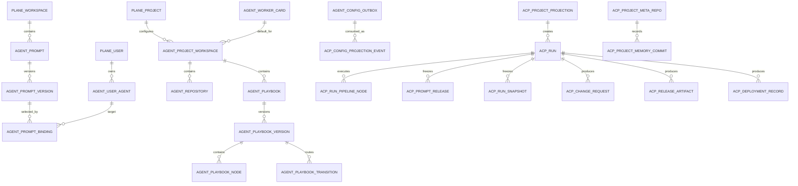

# Plane Agent Platform ERD Technical Design

Status: Technical Design
Last updated: 2026-06-25

## 背景

本文把 `docs/plane-agent-role-management.md` 中已定的 PRD 方案落成 ERD 技术方案。PRD 已明确：

- Plane 是 Agent / Prompt / Project Workspace / Run Pipeline 的唯一用户入口和可编辑事实源。
- Agent Control Plane 保存 Plane 同步来的 runtime projection，并在创建 run 时冻结 snapshot。
- Worker 运行在真实宿主机上，复用宿主机工具环境，并使用 per-run git worktree。
- 每个 Project Workspace 有本地 Project Meta Git，用于 `status.md`、append-only `progress.md`、run summary 和 artifact index。

本文只设计数据模型和迁移边界，不直接修改 Prisma schema 或 Plane schema。

## 设计原则

- Plane extension tables 承载用户可编辑配置。
- Agent Control Plane tables 承载运行投影、run pipeline、snapshot、lease、事件和审计。
- Worker local filesystem 承载真实 workspace、git worktree 和 Project Meta Git 文件。
- ACP 不直连 Plane DB；同步只通过 Plane extension API / outbox / webhook。
- Worker 不直连 ACP DB；Worker 只通过 Worker API claim、heartbeat、events、complete/fail。
- Run 创建时冻结一切执行输入：prompt versions、agent config、worker、repository、branch、pipeline gate mode、secret keys、meta context。

## 存储边界

```text
Plane DB
  Plane core tables
  agent_* extension tables
    editable source of truth
        |
        | polling first + webhook notify later
        v
Agent Control Plane DB
  existing runtime tables
  projected_* tables
  run snapshot / pipeline / node execution tables
        |
        | Worker API
        v
Worker host
  repo cache
  per-run git worktree
  project meta git
```

## 总体 ERD



## Plane Extension ERD

Plane extension tables 使用 `agent_` 前缀，避免污染 Plane upstream 核心表。它们通过 `workspace_id`、`project_id`、`user_id` 引用 Plane core ids，但本文不假设 Plane upstream 的具体表名。

### agent_user_agents

用户级 Agent。Phase 1 中 user-owned 但 workspace visible。

| 字段            | 类型        | 说明                           |
| --------------- | ----------- | ------------------------------ |
| id              | uuid        | 主键                           |
| workspace_id    | text        | Plane workspace id             |
| owner_user_id   | text        | Plane user id                  |
| name            | text        | Agent 名称                     |
| description     | text        | Agent 描述                     |
| default_model   | text        | 默认模型                       |
| default_role_id | uuid        | 默认 Role，可为空              |
| tool_profile    | jsonb       | 工具偏好，不等于运行时真实权限 |
| visibility      | text        | Phase 1 固定 `workspace`       |
| status          | text        | active / archived              |
| audit_version   | bigint      | 保存即递增，用于投影和审计     |
| created_by      | text        | Plane user id                  |
| updated_by      | text        | Plane user id                  |
| created_at      | timestamptz | 创建时间                       |
| updated_at      | timestamptz | 更新时间                       |

约束：

- `(workspace_id, owner_user_id, name)` unique where `status != archived`
- `visibility in ('workspace')` for Phase 1

说明：

- Phase 1 不暴露用户可选 Agent old version。
- 历史复现依赖 ACP run snapshot，而不是 Agent selectable version。

### agent_prompts

Workspace 级 Prompt 资源。

| 字段              | 类型        | 说明                                                           |
| ----------------- | ----------- | -------------------------------------------------------------- |
| id                | uuid        | 主键                                                           |
| workspace_id      | text        | Plane workspace id                                             |
| owner_user_id     | text        | 创建者                                                         |
| name              | text        | Prompt 名称                                                    |
| description       | text        | 描述                                                           |
| scope             | text        | agent / project / role / playbook / task / workspace           |
| kind              | text        | instruction / context / constraint / workflow / style / safety |
| visibility        | text        | Phase 1 固定 `workspace`                                       |
| latest_version_id | uuid        | 最新版本                                                       |
| status            | text        | active / archived                                              |
| created_at        | timestamptz | 创建时间                                                       |
| updated_at        | timestamptz | 更新时间                                                       |

约束：

- `(workspace_id, name)` unique where `status != archived`
- `scope` enum 由应用层约束

### agent_prompt_versions

Prompt 每次保存生成新版本，并成为 latest。

| 字段         | 类型        | 说明                  |
| ------------ | ----------- | --------------------- |
| id           | uuid        | 主键                  |
| prompt_id    | uuid        | 关联 `agent_prompts`  |
| version      | int         | 单 Prompt 内递增      |
| body         | text        | Prompt 内容           |
| variables    | jsonb       | 变量声明              |
| content_hash | text        | body + variables hash |
| changelog    | text        | 修改说明，可为空      |
| created_by   | text        | Plane user id         |
| created_at   | timestamptz | 创建时间              |

约束：

- `(prompt_id, version)` unique
- `(prompt_id, content_hash)` index

### agent_prompt_bindings

Prompt 绑定到 Agent / Project / Role / Playbook / Task / Workspace。版本策略在 Binding 上配置。

| 字段              | 类型        | 说明                                                      |
| ----------------- | ----------- | --------------------------------------------------------- |
| id                | uuid        | 主键                                                      |
| workspace_id      | text        | Plane workspace id                                        |
| target_type       | text        | user_agent / project / role / playbook / task / workspace |
| target_id         | text        | 目标对象 id，允许引用 Plane 或 extension object           |
| prompt_id         | uuid        | 关联 `agent_prompts`                                      |
| version_policy    | text        | latest / pinned                                           |
| pinned_version_id | uuid        | version_policy=pinned 时必填                              |
| scope             | text        | 继承 Prompt scope，也可冗余用于查询                       |
| order_index       | int         | 同 scope 内顺序                                           |
| required          | boolean     | 是否必需                                                  |
| status            | text        | active / disabled                                         |
| created_at        | timestamptz | 创建时间                                                  |
| updated_at        | timestamptz | 更新时间                                                  |

约束：

- `version_policy in ('latest', 'pinned')`
- `pinned_version_id is not null` when `version_policy='pinned'`
- `(target_type, target_id, prompt_id, scope)` unique where `status='active'`

### agent_user_secret_keys

用户级密码本 key 元数据。Plane / ACP / Worker 默认只投影 key，不投影 value。

| 字段          | 类型        | 说明                             |
| ------------- | ----------- | -------------------------------- |
| id            | uuid        | 主键                             |
| workspace_id  | text        | Plane workspace id               |
| owner_user_id | text        | Plane user id                    |
| key           | text        | 例如 `github_token`              |
| description   | text        | 描述                             |
| provider      | text        | local / 1password / env / future |
| provider_ref  | text        | secret provider 引用，不是明文值 |
| status        | text        | active / archived                |
| created_at    | timestamptz | 创建时间                         |
| updated_at    | timestamptz | 更新时间                         |

约束：

- `(workspace_id, owner_user_id, key)` unique where `status='active'`

### agent_project_workspaces

Project Workspace 的 Plane 侧配置。

| 字段                   | 类型        | 说明                                      |
| ---------------------- | ----------- | ----------------------------------------- |
| id                     | uuid        | 主键                                      |
| workspace_id           | text        | Plane workspace id                        |
| plane_project_id       | text        | Plane project id                          |
| slug                   | text        | Project workspace slug                    |
| name                   | text        | 展示名                                    |
| default_worker_card_id | uuid        | 默认 Worker Card                          |
| path_policy            | text        | worker_managed / custom_under_worker_root |
| meta_git_mode          | text        | local / remote_sync                       |
| meta_git_remote_url    | text        | Phase 2 使用                              |
| status                 | text        | active / archived                         |
| created_at             | timestamptz | 创建时间                                  |
| updated_at             | timestamptz | 更新时间                                  |

约束：

- `(workspace_id, plane_project_id)` unique
- `(workspace_id, slug)` unique

### agent_repositories

Project 下注册的代码仓库。Phase 1 创建代码执行 run 必填。

| 字段                 | 类型        | 说明                            |
| -------------------- | ----------- | ------------------------------- |
| id                   | uuid        | 主键                            |
| project_workspace_id | uuid        | 关联 `agent_project_workspaces` |
| scm_provider         | text        | github / gitlab                 |
| owner                | text        | repo owner/group                |
| name                 | text        | repo name                       |
| full_name            | text        | owner/name                      |
| clone_url            | text        | clone URL                       |
| default_branch       | text        | 默认 target branch              |
| credential_key       | text        | secret key，例如 `github_token` |
| worktree_strategy    | text        | Phase 1 默认 per_run            |
| status               | text        | active / archived               |
| created_at           | timestamptz | 创建时间                        |
| updated_at           | timestamptz | 更新时间                        |

约束：

- `(project_workspace_id, scm_provider, full_name)` unique
- `worktree_strategy='per_run'` for Phase 1

### agent_roles

Role 回答“这一步做什么”。

| 字段                | 类型        | 说明                                |
| ------------------- | ----------- | ----------------------------------- |
| id                  | uuid        | 主键                                |
| workspace_id        | text        | Plane workspace id                  |
| key                 | text        | builder / reviewer / merge / deploy |
| name                | text        | 展示名                              |
| description         | text        | 职责说明                            |
| default_permissions | jsonb       | 默认权限                            |
| output_contract     | jsonb       | 输出契约                            |
| status              | text        | active / archived                   |
| created_at          | timestamptz | 创建时间                            |
| updated_at          | timestamptz | 更新时间                            |

约束：

- `(workspace_id, key)` unique

### agent_project_agent_bindings

Project 绑定哪些 User Agent，以及默认 Agent。

| 字段                 | 类型        | 说明                       |
| -------------------- | ----------- | -------------------------- |
| id                   | uuid        | 主键                       |
| project_workspace_id | uuid        | Project Workspace          |
| user_agent_id        | uuid        | User Agent                 |
| is_project_default   | boolean     | 是否 Project default agent |
| allowed_role_ids     | uuid[]      | 允许承担的 Role            |
| default_role_id      | uuid        | 默认 Role                  |
| permission_overrides | jsonb       | 只能收紧权限               |
| status               | text        | active / disabled          |
| created_at           | timestamptz | 创建时间                   |
| updated_at           | timestamptz | 更新时间                   |

约束：

- `(project_workspace_id, user_agent_id)` unique
- partial unique `(project_workspace_id) where is_project_default=true`

### agent_assignment_templates

原 PRD 中的 Agent Team。技术上建议命名为 Assignment Template，UI 可继续显示 Team。

| 字段          | 类型        | 说明               |
| ------------- | ----------- | ------------------ |
| id            | uuid        | 主键               |
| workspace_id  | text        | Plane workspace id |
| owner_user_id | text        | 创建者             |
| name          | text        | 名称               |
| description   | text        | 描述               |
| status        | text        | active / archived  |
| created_at    | timestamptz | 创建时间           |
| updated_at    | timestamptz | 更新时间           |

### agent_assignment_template_nodes

| 字段                   | 类型 | 说明            |
| ---------------------- | ---- | --------------- |
| id                     | uuid | 主键            |
| assignment_template_id | uuid | 模板            |
| playbook_node_key      | text | node key        |
| role_id                | uuid | Role            |
| default_user_agent_id  | uuid | 默认 User Agent |
| order_index            | int  | 顺序            |

约束：

- `(assignment_template_id, playbook_node_key)` unique

### agent_playbooks / agent_playbook_versions

Playbook 保存即生成新版本。Run 创建时从某个 Playbook Version 复制出 Run Pipeline。

`agent_playbooks`：

| 字段              | 类型        | 说明               |
| ----------------- | ----------- | ------------------ |
| id                | uuid        | 主键               |
| workspace_id      | text        | Plane workspace id |
| owner_user_id     | text        | 创建者             |
| name              | text        | 名称               |
| description       | text        | 描述               |
| latest_version_id | uuid        | 最新版本           |
| status            | text        | active / archived  |
| created_at        | timestamptz | 创建时间           |
| updated_at        | timestamptz | 更新时间           |

`agent_playbook_versions`：

| 字段                           | 类型        | 说明                     |
| ------------------------------ | ----------- | ------------------------ |
| id                             | uuid        | 主键                     |
| playbook_id                    | uuid        | Playbook                 |
| version                        | int         | 版本                     |
| default_assignment_template_id | uuid        | 默认 assignment template |
| created_by                     | text        | Plane user id            |
| created_at                     | timestamptz | 创建时间                 |

约束：

- `(playbook_id, version)` unique

### agent_playbook_nodes

| 字段                | 类型  | 说明                                       |
| ------------------- | ----- | ------------------------------------------ |
| id                  | uuid  | 主键                                       |
| playbook_version_id | uuid  | Playbook Version                           |
| node_key            | text  | development / agent_code_review / merge 等 |
| node_type           | text  | agent / human_gate                         |
| role_id             | uuid  | Agent node 使用的 Role，human_gate 可为空  |
| title               | text  | 展示名                                     |
| prerequisite_policy | jsonb | 默认 prerequisite                          |
| output_contract     | jsonb | 节点输出契约                               |
| order_index         | int   | 展示顺序                                   |

约束：

- `(playbook_version_id, node_key)` unique

### agent_playbook_transitions

| 字段                | 类型  | 说明                                       |
| ------------------- | ----- | ------------------------------------------ |
| id                  | uuid  | 主键                                       |
| playbook_version_id | uuid  | Playbook Version                           |
| from_node_key       | text  | 来源 node                                  |
| to_node_key         | text  | 目标 node                                  |
| condition           | jsonb | approve / request_changes / needs_human 等 |
| default_gate_mode   | text  | manual / auto / conditional                |
| order_index         | int   | 顺序                                       |

约束：

- `(playbook_version_id, from_node_key, to_node_key, order_index)` unique

### agent_worker_cards

Plane 可见的真实 Worker 机器。

| 字段           | 类型        | 说明                          |
| -------------- | ----------- | ----------------------------- |
| id             | uuid        | 主键                          |
| workspace_id   | text        | Plane workspace id            |
| name           | text        | Mac Studio / MBP              |
| worker_id      | text        | Worker API register id        |
| hostname       | text        | host                          |
| os             | text        | macOS / linux                 |
| labels         | jsonb       | mac / docker / codex / deploy |
| workspace_root | text        | root path                     |
| status         | text        | online / offline / busy       |
| last_seen_at   | timestamptz | 最近 heartbeat                |
| created_at     | timestamptz | 创建时间                      |
| updated_at     | timestamptz | 更新时间                      |

约束：

- `(workspace_id, worker_id)` unique

### agent_config_outbox

Plane -> ACP projection sync 的增量源。Phase 1 ACP 定时 polling；Phase 2 webhook 只做通知 ACP 来拉。

| 字段               | 类型        | 说明                      |
| ------------------ | ----------- | ------------------------- |
| id                 | bigint      | 单调递增 cursor           |
| workspace_id       | text        | Plane workspace id        |
| entity_type        | text        | user_agent / prompt / ... |
| entity_id          | text        | entity id                 |
| operation          | text        | upsert / archive / delete |
| projection_version | bigint      | entity 版本               |
| payload            | jsonb       | 可执行 projection payload |
| created_at         | timestamptz | 创建时间                  |

约束：

- `(workspace_id, id)` cursor index
- `(entity_type, entity_id, projection_version)` unique

## Agent Control Plane Runtime ERD

ACP 侧不再把 Agent/Prompt 作为编辑源，而是保存 Plane projection 和 run snapshot。现有 `teams/projects/repositories/tasks/runs/prompt_releases/workspaces/run_events` 可继续保留，逐步新增 projection 和 pipeline 表。

### acp_config_projection_events

记录已消费的 Plane outbox 事件。

| 字段               | 类型        | 说明                       |
| ------------------ | ----------- | -------------------------- |
| id                 | uuid        | 主键                       |
| plane_workspace_id | text        | Plane workspace id         |
| plane_outbox_id    | bigint      | Plane outbox cursor        |
| entity_type        | text        | entity type                |
| entity_id          | text        | Plane entity id            |
| projection_version | bigint      | projection version         |
| payload_hash       | text        | payload hash               |
| status             | text        | applied / skipped / failed |
| error              | text        | 失败原因                   |
| created_at         | timestamptz | 创建时间                   |

约束：

- `(plane_workspace_id, plane_outbox_id)` unique

### acp_project_projections

Plane Project Workspace 的 runtime projection。

| 字段                       | 类型        | 说明                       |
| -------------------------- | ----------- | -------------------------- |
| id                         | uuid        | 主键                       |
| plane_project_workspace_id | text        | Plane source id            |
| plane_workspace_id         | text        | Plane workspace id         |
| plane_project_id           | text        | Plane project id           |
| slug                       | text        | project slug               |
| default_worker_id          | text        | Worker id                  |
| meta_git_policy            | jsonb       | local / remote sync config |
| projection_version         | bigint      | 源版本                     |
| source_updated_at          | timestamptz | Plane 更新时间             |
| updated_at                 | timestamptz | ACP 更新时间               |

约束：

- `(plane_project_workspace_id)` unique
- `(plane_workspace_id, slug)` unique

### acp_user_agent_projections

| 字段                | 类型        | 说明              |
| ------------------- | ----------- | ----------------- |
| id                  | uuid        | 主键              |
| plane_user_agent_id | text        | Plane source id   |
| owner_user_id       | text        | Plane user id     |
| name                | text        | 名称              |
| default_model       | text        | 模型              |
| tool_profile        | jsonb       | 工具偏好          |
| config_snapshot     | jsonb       | 完整可执行配置    |
| projection_version  | bigint      | 源版本            |
| status              | text        | active / archived |
| updated_at          | timestamptz | 更新时间          |

### acp_prompt_projections / acp_prompt_version_projections / acp_prompt_binding_projections

ACP 保存 Prompt projection 以便 run 创建时解析 versions。

`acp_prompt_projections`：

| 字段               | 类型   | 说明                 |
| ------------------ | ------ | -------------------- |
| id                 | uuid   | 主键                 |
| plane_prompt_id    | text   | Plane prompt id      |
| workspace_id       | text   | Plane workspace id   |
| name               | text   | 名称                 |
| scope              | text   | agent/project/...    |
| kind               | text   | instruction/...      |
| latest_version_id  | text   | Plane latest version |
| projection_version | bigint | 源版本               |
| status             | text   | active / archived    |

`acp_prompt_version_projections`：

| 字段                    | 类型        | 说明             |
| ----------------------- | ----------- | ---------------- |
| id                      | uuid        | 主键             |
| plane_prompt_version_id | text        | Plane version id |
| plane_prompt_id         | text        | Plane prompt id  |
| version                 | int         | 版本号           |
| body                    | text        | Prompt 内容      |
| variables               | jsonb       | 变量声明         |
| content_hash            | text        | 内容 hash        |
| created_at              | timestamptz | Plane 创建时间   |

`acp_prompt_binding_projections`：

| 字段               | 类型    | 说明                    |
| ------------------ | ------- | ----------------------- |
| id                 | uuid    | 主键                    |
| plane_binding_id   | text    | Plane binding id        |
| target_type        | text    | user_agent/project/...  |
| target_id          | text    | Plane target id         |
| plane_prompt_id    | text    | Plane prompt id         |
| version_policy     | text    | latest / pinned         |
| pinned_version_id  | text    | Plane prompt version id |
| scope              | text    | scope                   |
| order_index        | int     | order                   |
| required           | boolean | required                |
| status             | text    | active / disabled       |
| projection_version | bigint  | 源版本                  |

### acp_worker_card_projections

Worker Card projection。ACP claim 时使用 worker id 和 labels，不读取 Plane。

| 字段                 | 类型        | 说明                |
| -------------------- | ----------- | ------------------- |
| id                   | uuid        | 主键                |
| plane_worker_card_id | text        | Plane source id     |
| plane_workspace_id   | text        | Plane workspace id  |
| worker_id            | text        | Worker API id       |
| name                 | text        | 展示名              |
| hostname             | text        | host                |
| os                   | text        | OS                  |
| labels               | jsonb       | labels              |
| workspace_root       | text        | workspace root      |
| last_seen_at         | timestamptz | heartbeat           |
| status               | text        | online/offline/busy |
| projection_version   | bigint      | 源版本              |

### acp_run_snapshots

Run 创建时冻结的完整执行输入。用于复盘和 Worker claim。

| 字段          | 类型        | 说明                |
| ------------- | ----------- | ------------------- |
| id            | uuid        | 主键                |
| run_id        | uuid        | 关联 `runs`         |
| snapshot_hash | text        | JSON canonical hash |
| payload       | jsonb       | frozen snapshot     |
| created_at    | timestamptz | 创建时间            |

payload 至少包含：

- task / repository / branches
- worker card
- run pipeline nodes / transitions / gate modes
- node assignments
- resolved prompt versions
- assembled prompt preview
- available secret keys
- project meta context summary
- role / agent config snapshot

约束：

- `run_id` unique
- `snapshot_hash` index

### acp_run_pipelines

Run Pipeline 是 Playbook Version 的运行时副本。

| 字段                      | 类型        | 说明                          |
| ------------------------- | ----------- | ----------------------------- |
| id                        | uuid        | 主键                          |
| run_id                    | uuid        | Run                           |
| plane_playbook_version_id | text        | Plane source version id       |
| status                    | text        | active / completed / canceled |
| created_at                | timestamptz | 创建时间                      |
| updated_at                | timestamptz | 更新时间                      |

约束：

- `run_id` unique

### acp_run_pipeline_nodes

| 字段                  | 类型        | 说明                                                       |
| --------------------- | ----------- | ---------------------------------------------------------- |
| id                    | uuid        | 主键                                                       |
| run_pipeline_id       | uuid        | Run Pipeline                                               |
| node_key              | text        | node key                                                   |
| node_type             | text        | agent / human_gate                                         |
| role_key              | text        | role                                                       |
| assigned_agent_id     | text        | Plane User Agent id                                        |
| worker_id             | text        | frozen worker id                                           |
| status                | text        | pending / running / succeeded / blocked / failed / skipped |
| prerequisite_policy   | jsonb       | frozen prerequisite policy                                 |
| missing_prerequisites | jsonb       | 最近一次检查缺口                                           |
| output_summary        | text        | 输出摘要                                                   |
| artifacts             | jsonb       | 输出 artifacts                                             |
| started_at            | timestamptz | 开始时间                                                   |
| finished_at           | timestamptz | 结束时间                                                   |

约束：

- `(run_pipeline_id, node_key)` unique

### acp_run_pipeline_transitions

| 字段            | 类型        | 说明                        |
| --------------- | ----------- | --------------------------- |
| id              | uuid        | 主键                        |
| run_pipeline_id | uuid        | Run Pipeline                |
| from_node_key   | text        | 来源 node                   |
| to_node_key     | text        | 目标 node                   |
| condition       | jsonb       | 条件                        |
| gate_mode       | text        | manual / auto / conditional |
| changed_by      | text        | 最近修改人                  |
| changed_at      | timestamptz | 最近修改时间                |

约束：

- `(run_pipeline_id, from_node_key, to_node_key)` unique

### acp_node_executions

节点每次执行尝试。支持 rework / retry / rerun。

| 字段                 | 类型        | 说明                                                     |
| -------------------- | ----------- | -------------------------------------------------------- |
| id                   | uuid        | 主键                                                     |
| run_id               | uuid        | Run                                                      |
| run_pipeline_node_id | uuid        | Node                                                     |
| attempt              | int         | 节点尝试次数                                             |
| status               | text        | queued / running / succeeded / failed / blocked          |
| agent_id             | text        | frozen Plane User Agent id                               |
| worker_id            | text        | worker                                                   |
| prompt_release_id    | uuid        | prompt release                                           |
| started_at           | timestamptz | 开始                                                     |
| finished_at          | timestamptz | 结束                                                     |
| result_summary       | text        | 摘要                                                     |
| failure_type         | text        | transient / validation / permission / conflict / unknown |
| failure_reason       | text        | 失败原因                                                 |
| output_payload       | jsonb       | 标准化 node output                                       |

约束：

- `(run_pipeline_node_id, attempt)` unique

### acp_prerequisite_checks

| 字段       | 类型        | 说明             |
| ---------- | ----------- | ---------------- |
| id         | uuid        | 主键             |
| run_id     | uuid        | Run              |
| node_key   | text        | node             |
| checked_by | text        | system / user id |
| status     | text        | passed / blocked |
| missing    | jsonb       | 缺失项           |
| checked_at | timestamptz | 检查时间         |

### acp_scm_change_requests

SCM Change Request 抽象 GitHub PR / GitLab MR。

| 字段           | 类型        | 说明                                    |
| -------------- | ----------- | --------------------------------------- |
| id             | uuid        | 主键                                    |
| run_id         | uuid        | Run                                     |
| repository_id  | uuid        | ACP repository                          |
| provider       | text        | github / gitlab                         |
| external_id    | text        | PR/MR id                                |
| url            | text        | URL                                     |
| source_branch  | text        | work branch                             |
| target_branch  | text        | target branch                           |
| status         | text        | open / merged / closed                  |
| review_verdict | text        | approve / request_changes / needs_human |
| last_synced_at | timestamptz | 最近同步                                |
| created_at     | timestamptz | 创建时间                                |
| updated_at     | timestamptz | 更新时间                                |

约束：

- `(provider, external_id)` unique
- `(run_id)` index

### acp_release_artifacts

Release 是制品/镜像发布。

| 字段          | 类型        | 说明                        |
| ------------- | ----------- | --------------------------- |
| id            | uuid        | 主键                        |
| run_id        | uuid        | Run                         |
| repository_id | uuid        | Repository                  |
| version       | text        | version/tag                 |
| tag           | text        | git tag                     |
| image         | text        | image name                  |
| image_digest  | text        | digest                      |
| release_url   | text        | SCM release URL             |
| notes         | text        | release notes               |
| status        | text        | released / failed / blocked |
| created_at    | timestamptz | 创建时间                    |

### acp_deployment_records

Deployment 是真实部署。

| 字段                | 类型        | 说明                            |
| ------------------- | ----------- | ------------------------------- |
| id                  | uuid        | 主键                            |
| run_id              | uuid        | Run                             |
| release_artifact_id | uuid        | Release artifact                |
| environment         | text        | production / staging / local    |
| target_host         | text        | MBP / Mac Studio                |
| service_name        | text        | service                         |
| image_digest        | text        | deployed digest                 |
| deployment_url      | text        | URL                             |
| health_status       | text        | passed / failed                 |
| rollback_ref        | text        | rollback ref                    |
| status              | text        | deployed / failed / rolled_back |
| evidence            | jsonb       | health check / logs refs        |
| created_at          | timestamptz | 创建时间                        |

### acp_project_meta_repos

ACP 记录 Project Meta Git 的位置和最新状态；文件内容仍在 git repo。

| 字段                  | 类型        | 说明                         |
| --------------------- | ----------- | ---------------------------- |
| id                    | uuid        | 主键                         |
| project_projection_id | uuid        | Project projection           |
| worker_id             | text        | 当前承载 worker              |
| local_path            | text        | meta repo path               |
| remote_url            | text        | Phase 2 remote               |
| current_commit_sha    | text        | 最新 commit                  |
| sync_status           | text        | local_only / synced / failed |
| last_synced_at        | timestamptz | Phase 2 使用                 |
| updated_at            | timestamptz | 更新时间                     |

### acp_project_memory_commits

| 字段                 | 类型        | 说明                                                           |
| -------------------- | ----------- | -------------------------------------------------------------- |
| id                   | uuid        | 主键                                                           |
| project_meta_repo_id | uuid        | meta repo                                                      |
| run_id               | uuid        | 可为空                                                         |
| node_key             | text        | 可为空                                                         |
| commit_sha           | text        | git commit                                                     |
| action               | text        | status_update / progress_append / run_summary / artifact_index |
| files_changed        | text[]      | 文件                                                           |
| summary              | text        | 摘要                                                           |
| actor_type           | text        | user / agent / system                                          |
| actor_id             | text        | actor                                                          |
| created_at           | timestamptz | 创建时间                                                       |

约束：

- `(project_meta_repo_id, commit_sha)` unique

## 与现有 ACP 表的关系

| 现有表              | 保留方式                            | 需要演进                                                                         |
| ------------------- | ----------------------------------- | -------------------------------------------------------------------------------- |
| `projects`          | 继续作为 ACP runtime project mirror | 增加或旁挂 `acp_project_projections`，不要把 Plane editable config 塞入旧表      |
| `repositories`      | 继续作为 runtime repo mirror        | 增加 scm provider、full_name、credential key、worktree policy projection         |
| `roles`             | 继续支持 runtime role lookup        | Role editable source 转到 Plane extension，ACP 保存 projection                   |
| `agent_definitions` | 短期兼容                            | 长期由 `acp_user_agent_projections` 替代 editable source 语义                    |
| `prompt_components` | 短期兼容                            | 长期由 Prompt projection + prompt release 替代 editable source 语义              |
| `prompt_bindings`   | 短期兼容                            | 增加 `version_policy/pinned_version` 或迁移到 projection binding                 |
| `prompt_releases`   | 保留                                | 增加 assembled prompt preview metadata / source projection versions              |
| `runs`              | 保留                                | 增加 run pipeline/snapshot 关联，或以旁表方式扩展                                |
| `workspaces`        | 保留                                | 明确 per-run git worktree、base/target/work branch 和 cleanup TTL                |
| `run_events`        | 保留                                | 增加 gate mode change、manual move、prerequisite blocked、meta git commit events |

## 同步设计

### Phase 1: Polling first

```text
ACP sync job:
  cursor = last applied Plane outbox id
  GET /api/agent-config/projections?cursor=<cursor>&limit=...
  validate payload schema
  upsert projection table
  write acp_config_projection_events
  advance cursor only after transaction commit
```

规则：

- 每条 outbox event 必须幂等。
- ACP 按 `(entity_type, entity_id, projection_version)` 去重。
- 失败事件不推进 cursor，或推进到失败队列并报警，二选一需要实现前定。
- 创建 run 时，Plane 请求带 `required_projection_version`；ACP 若未同步到该版本，先 sync-on-demand，再决定创建或拒绝。

### Phase 2: Webhook notify

Webhook 只做通知：

```text
Plane webhook -> ACP receives "workspace changed"
ACP immediately polls outbox
```

Webhook 丢失不影响一致性，因为 polling 仍兜底。

## Run 创建事务

```text
1. Plane sends create run request:
   project_workspace_id
   repository_id
   worker_card_id
   playbook_version_id
   node assignments
   gate mode overrides
   task prompt
   required_projection_version

2. ACP verifies projections are fresh enough.

3. ACP resolves:
   project / repository / worker
   prompt bindings latest/pinned
   agent assignments
   playbook nodes/transitions
   available secret keys
   project meta context

4. ACP writes in one transaction:
   runs
   acp_run_snapshots
   acp_run_pipelines
   acp_run_pipeline_nodes
   acp_run_pipeline_transitions
   prompt_releases / prompt_release_components
   run_events(run.created)

5. Worker later claims by worker_id.
```

## Project Meta Git 写入模型

Meta Git 文件不是用户直接编辑入口。Plane UI 调用 API，ACP/Worker 渲染文件并提交 git commit。

写入触发：

- node completed / failed / blocked
- human gate action
- user status edit
- user progress append

文件规则：

- `status.md`: 可重写的当前快照。
- `progress.md`: append-only；错误通过 correction entry 追加。
- `runs/<run_id>.md`: run summary。
- `artifacts/index.md`: Change Request / release / deployment evidence index。

ACP 记录 `acp_project_memory_commits`，但不把 markdown 全文复制到主业务表。

## 索引与查询面

Command Center 需要的核心查询：

- Project current status: `acp_project_projections` + latest active run + latest memory commit。
- Pipeline: `acp_run_pipelines` + nodes + transitions + latest node executions。
- Memory Status: 从 Meta Git 读取 `status.md`，并可缓存摘要。
- Progress timeline: 读取 `progress.md` 最近 N 条，必要时缓存摘要。
- Artifacts: `acp_scm_change_requests`、`acp_release_artifacts`、`acp_deployment_records` + `artifacts/index.md`。
- Run Detail: `runs` + `acp_run_snapshots` + `prompt_releases` + `run_events` + node executions。

建议索引：

- `acp_run_pipeline_nodes(run_pipeline_id, status)`
- `acp_node_executions(run_id, started_at desc)`
- `acp_prerequisite_checks(run_pipeline_node_id, status)`
- `acp_scm_change_requests(run_id)`
- `acp_release_artifacts(run_id, created_at desc)`
- `acp_deployment_records(run_id, created_at desc)`
- `acp_project_memory_commits(project_meta_repo_id, created_at desc)`

## ACP Phase 1 实现映射

Status: Implemented in ACP runtime foundation.

落地文件：

- DB migration: `packages/db/prisma/migrations/0010_plane_agent_runtime_foundation/migration.sql`
- Prisma models: `packages/db/prisma/schema.prisma`
- Runtime helpers: `packages/db/src/plane-agent-runtime.ts`
- Plane outbox client: `packages/plane/src/client.ts`
- Plane outbox polling sync: `packages/plane/src/sync.ts`
- CLI: `scripts/plane-agent-config-sync.mjs`
- CLI self-test: `scripts/plane-agent-config-sync-self-test.mjs`

已实现范围：

- `acp_config_projection_events`
- `acp_project_projections`
- `acp_user_agent_projections`
- `acp_prompt_projections`
- `acp_prompt_version_projections`
- `acp_prompt_binding_projections`
- `acp_worker_card_projections`
- `acp_run_snapshots`
- `acp_run_pipelines`
- `acp_run_pipeline_nodes`
- `acp_run_pipeline_transitions`
- `acp_node_executions`
- `acp_prerequisite_checks`
- `acp_scm_change_requests`
- `acp_release_artifacts`
- `acp_deployment_records`
- `acp_project_meta_repos`
- `acp_project_memory_commits`

未实现范围仍按迁移顺序推进：

- Plane repo 内 `agent_*` extension source tables、CRUD UI、`agent_config_outbox` API。
- Run 创建链路自动解析 Plane projections 并调用 snapshot / pipeline helper。
- Worker claim 按 Worker Card projection 定向执行。
- Project Meta Git 真实文件写入和 git commit。

## 迁移顺序

### M1: Plane extension source tables

- 新增 Plane `agent_*` extension tables。
- 实现 Plane Agent Library、Prompt Library、Project Workspace 的最小 CRUD。
- 实现 `agent_config_outbox`。

### M2: ACP projection tables

- 新增 ACP projection tables 和 sync job。
- polling first，支持 sync-on-demand。
- 不改变现有 worker 执行链路。

### M3: Run snapshot and pipeline

- 新增 run snapshot / pipeline / node / transition / prerequisite tables。
- Run create 从 Playbook Version 复制 Run Pipeline。
- 支持 gate mode 动态切换和 manual move。

### M4: Prompt Preview and Binding policy

- Prompt Binding 支持 latest/pinned。
- Run create / Run detail 展示 assembled prompt preview 和 available secret keys。
- Prompt release 记录 resolved source versions。

### M5: Worker Card and worktree

- Plane 配置 Worker Card 和 Project default worker。
- ACP claim 指定 worker id。
- Worker 创建 per-run git worktree，并记录 cleanup TTL。

### M6: SCM / Release / Deployment evidence

- 新增 Change Request、Release Artifact、Deployment Record。
- Agent Review 写 SCM + Plane summary。
- Release 与 Deployment 分离。

### M7: Project Meta Git

- Worker 初始化本地 Meta Git。
- status rewrite、progress append、run summary、artifact index 写入。
- ACP 记录 memory commits。
- Phase 2 再做 remote auto-create / scheduled sync。

## 未决技术点

- Plane extension tables 与 Plane upstream migration 的具体集成方式。
- Outbox 失败事件是阻塞 cursor 还是进入 dead-letter 队列。
- Secret value 的 Phase 1 存储/provider 方案；本文只要求 projection 不含 value。
- Project Meta Git 的并发写锁：Phase 1 可按 project 串行化，Phase 2 再处理 remote conflict。
- GitHub/GitLab provider 抽象第一期接口范围。
